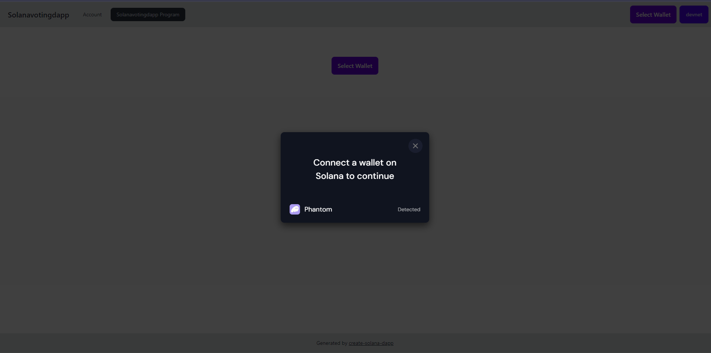
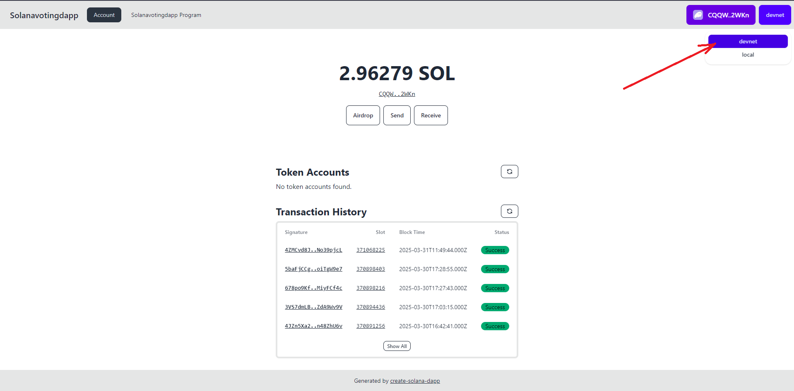
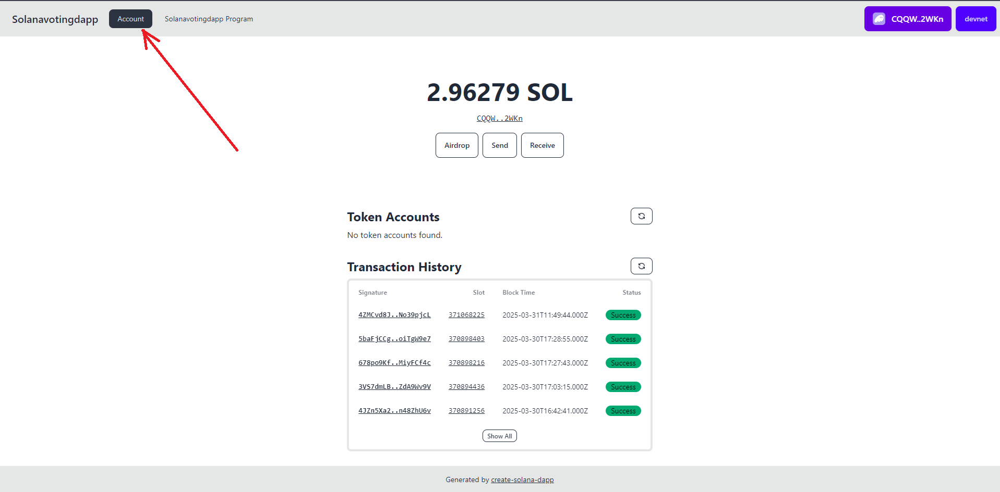
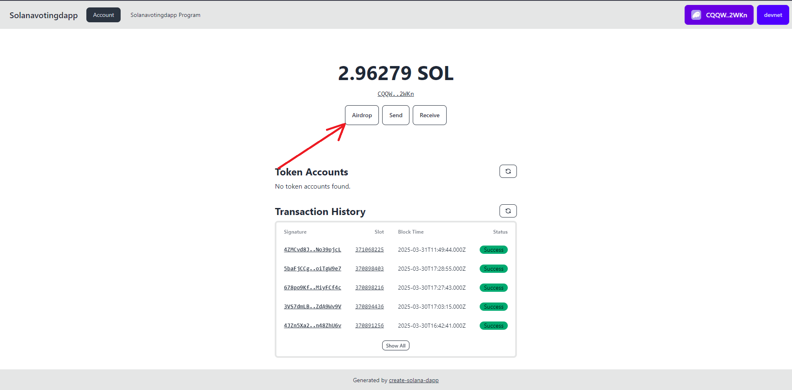
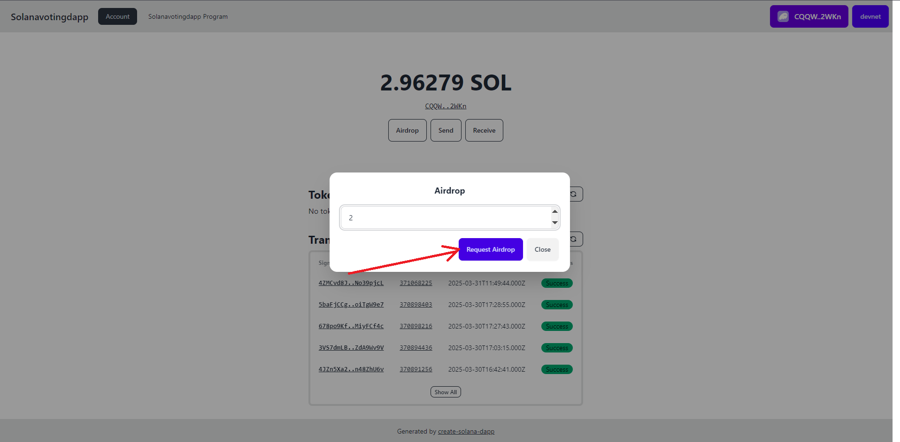
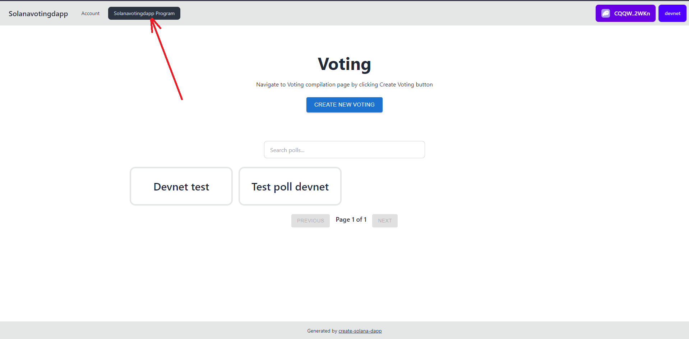

# solana-voting-dapp

# User site instruction

Use link: https://solana-voting-dapp-alpha.vercel.app/

In order to use application\
Firstly connect your Phantom wallet


Then, in the top right corner select "devnet"


Then, go to the "Account" page


And request Airdrop



Now you can go into "Solanavotingdapp program" and create your own Votings and Vote in existing ones


## Getting Started

### Prerequisites

- Node v18.18.0 or higher

- Rust v1.77.2 or higher
- Anchor CLI 0.30.1 or higher
- Solana CLI 1.18.17 or higher

### Installation

#### Clone the repo

```shell
git clone <repo-url>
cd <repo-name>
```

#### Install Dependencies

```shell
pnpm install
```

#### Start the web app

```
pnpm dev
```

## Apps

### anchor

This is a Solana program written in Rust using the Anchor framework.

#### Commands

You can use any normal anchor commands. Either move to the `anchor` directory and run the `anchor` command or prefix the
command with `pnpm`, eg: `pnpm anchor`.

#### Sync the program id:

Running this command will create a new keypair in the `anchor/target/deploy` directory and save the address to the
Anchor config file and update the `declare_id!` macro in the `./src/lib.rs` file of the program.

You will manually need to update the constant in `anchor/lib/counter-exports.ts` to match the new program id.

```shell
pnpm anchor keys sync
```

#### Build the program:

```shell
pnpm anchor-build
```

#### Start the test validator with the program deployed:

```shell
pnpm anchor-localnet
```

#### Run the tests

```shell
pnpm anchor-test
```

#### Deploy to Devnet

```shell
pnpm anchor deploy --provider.cluster devnet
```

### web

This is a React app that uses the Anchor generated client to interact with the Solana program.

#### Commands

Start the web app

```shell
pnpm dev
```

Build the web app

```shell
pnpm build
```
